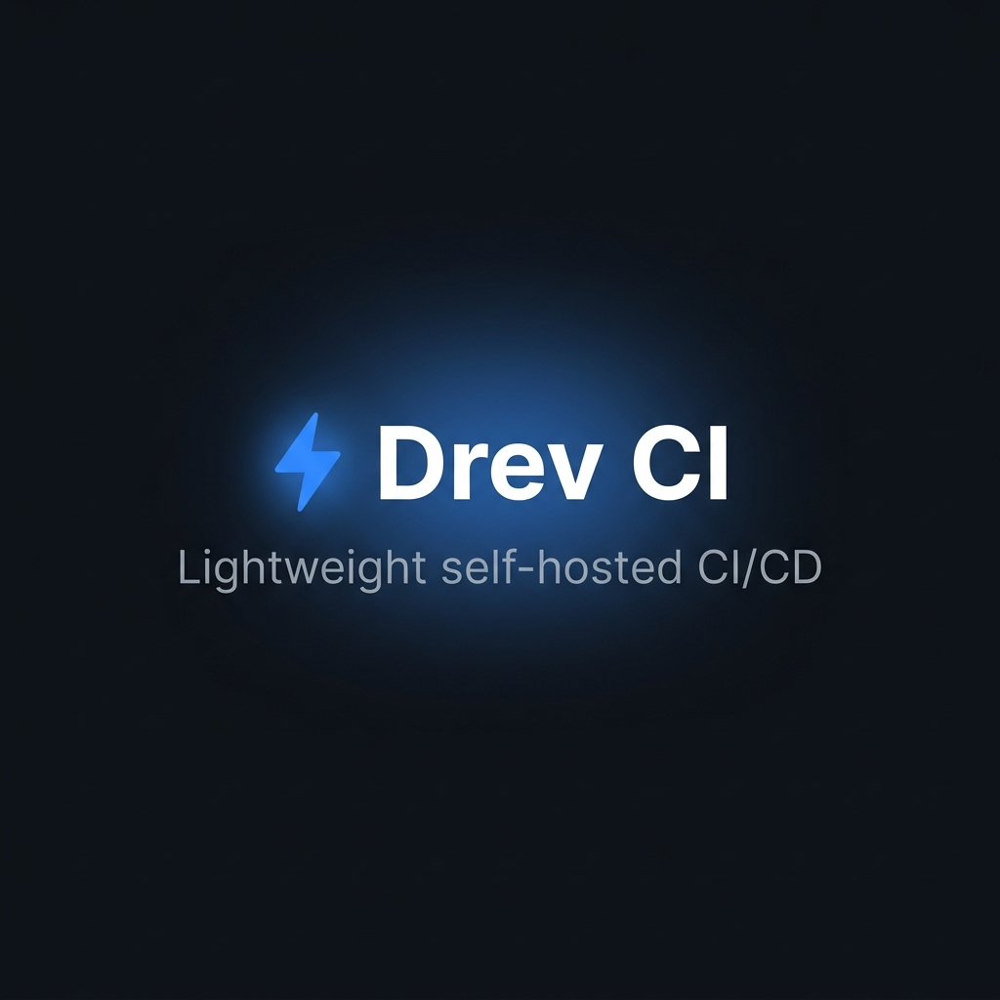

<p align="center">
  
</p>

<h1 align="center">Drev CI — Marketing Website</h1>

<p align="center">
  <strong>The SaaS marketing site for <a href="https://github.com/KoushikSagarr/drevci">Drev CI</a> — a lightweight, self-hosted CI/CD engine built in Go.</strong>
</p>

<p align="center">
  <a href="https://drevci.com">Live Site</a> · 
  <a href="https://github.com/KoushikSagarr/drevci">Drev CI Engine</a> · 
  <a href="https://github.com/KoushikSagarr/drevci-website/issues">Report Bug</a>
</p>

---

## Overview

This is the public-facing marketing website for **Drev CI** — designed to convert visitors into customers. It showcases features, pricing, documentation, and an engineering blog.

**Live at:** [drevci.com](https://drevci.com)

## Tech Stack

| Layer | Technology |
|-------|-----------|
| Framework | [Next.js 14](https://nextjs.org/) (App Router) |
| Language | TypeScript |
| Styling | [Tailwind CSS](https://tailwindcss.com/) v3 |
| Animations | [Framer Motion](https://www.framer.com/motion/) |
| Font | [Inter](https://fonts.google.com/specimen/Inter) (Google Fonts) |
| Deployment | Vercel / Self-hosted |

## Design System

```
Background:       #0d1117
Surface:          #161b22
Border:           #30363d
Text Primary:     #e6edf3
Text Secondary:   #8b949e
Accent (Blue):    #388bfd
Success (Green):  #3fb950
Danger (Red):     #f85149
```

## Pages

| Route | Description |
|-------|-------------|
| `/` | Landing page — Hero, comparison, features, how-it-works, pipeline demo, testimonials, pricing, waitlist |
| `/pricing` | Full pricing page with 4 tiers, feature comparison table, FAQ |
| `/blog` | Engineering blog index |
| `/blog/[slug]` | Individual blog posts |
| `/docs` | Getting started documentation with sidebar |
| `/api/waitlist` | Waitlist signup API (POST/GET) |

## Project Structure

```
drevci-website/
├── src/
│   ├── app/
│   │   ├── layout.tsx              # Root layout, fonts, metadata
│   │   ├── page.tsx                # Landing page
│   │   ├── pricing/page.tsx        # Pricing page
│   │   ├── blog/
│   │   │   ├── page.tsx            # Blog index
│   │   │   └── [slug]/page.tsx     # Blog post
│   │   ├── docs/page.tsx           # Documentation
│   │   └── api/waitlist/route.ts   # Waitlist API
│   ├── components/
│   │   ├── Navbar.tsx              # Sticky nav with mobile menu
│   │   ├── Footer.tsx              # Site footer
│   │   ├── Hero.tsx                # Landing hero with terminal demo
│   │   ├── TerminalHero.tsx        # Animated terminal output
│   │   ├── ComparisonTable.tsx     # Old way vs Drev CI
│   │   ├── Features.tsx            # Bento grid feature cards
│   │   ├── HowItWorks.tsx          # 3-step setup flow
│   │   ├── PipelineDemo.tsx        # Animated pipeline visualization
│   │   ├── Testimonials.tsx        # Customer testimonial cards
│   │   ├── PricingCard.tsx         # Reusable pricing card
│   │   └── WaitlistForm.tsx        # Email signup with API
│   └── lib/
│       └── waitlist.ts             # In-memory waitlist store
├── public/
│   └── og-image.png                # Open Graph social image
├── tailwind.config.js
├── postcss.config.js
├── next.config.mjs
└── tsconfig.json
```

## Getting Started

### Prerequisites

- Node.js 18+
- npm

### Install & Run

```bash
# Clone the repo
git clone https://github.com/KoushikSagarr/drevci-website.git
cd drevci-website

# Install dependencies
npm install

# Start dev server (port 4000)
npm run dev
```

Open [http://localhost:4000](http://localhost:4000) in your browser.

### Build for Production

```bash
npm run build
npm start
```

## Key Features

- **🎨 Dark theme** — GitHub-inspired design system with glassmorphism navbar
- **⚡ Framer Motion** — Scroll-triggered animations on every section
- **📟 Terminal demo** — Animated line-by-line pipeline output in the hero
- **🔄 Pipeline visualization** — CSS-animated stage progression (Clone → Test → Build)
- **📝 Blog system** — Dynamic routes with full article content
- **📖 Documentation** — Sidebar navigation with code blocks and CLI reference
- **📧 Waitlist API** — In-memory email collection with client-side persistence
- **📱 Fully responsive** — Mobile-first with collapsible navigation
- **🔍 SEO optimized** — Open Graph, Twitter cards, meta descriptions

## Related

- [Drev CI Engine](https://github.com/KoushikSagarr/drevci) — The Go-based CI/CD engine
- [Drev CI Dashboard](https://github.com/KoushikSagarr/drevci) — Real-time pipeline dashboard

## License

MIT © 2026 Drev CI
